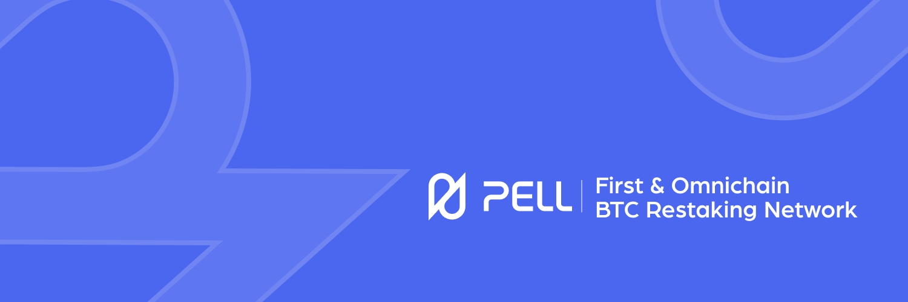

<h1 align="center">AI Powered Omnichain DeFAI Ecosystem </h1>

# Pell Network

## DeFAI Infrastructure Secured by Shared Security

Pell Network is transforming Bitcoin's passive security into active productivity through innovative restaking mechanisms and AI-powered optimization.

### Our Mission

Building the first "security-intelligence-data" self-evolving protocol that bridges Bitcoin's security value with the DeFAI ecosystem.

### Core Products

**Megapool**: AI-powered restaking optimizer that delivers triple-layered returns (base + restaking + DeFi yields) for BTC holders.

**DVS System**: Decentralized Validated Services that enable distributed validation across various applications. Leverages restaked BTC and LSDs to provide enhanced security with reduced capital costs, while rewarding Network Operators through cryptoeconomic incentives and enforcing accountability via smart contract-governed slashing mechanisms.

### Repositories

- [pelldvs](https://github.com/0xPellNetwork/pelldvs) - Decentralized validator infrastructure
- [pellapp-sdk](https://github.com/0xPellNetwork/pellapp-sdk) - SDK for build Pell DVS applications
- [megapool](https://github.com/0xPellNetwork/megapool) - AI-powered restaking optimizer
- [aegis](https://github.com/0xPellNetwork/aegis) - Pell network core blockchain. Compatibility with EVM and CosmWasm

### Links

[Website](https://pell.network) | [Docs](https://docs.pell.network) | [Blog](https://medium.com/@pell-network) | [Twitter](https://twitter.com/Pell_Network) | [Discord](https://discord.gg/PnxcEpQH)
